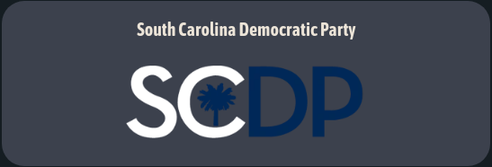
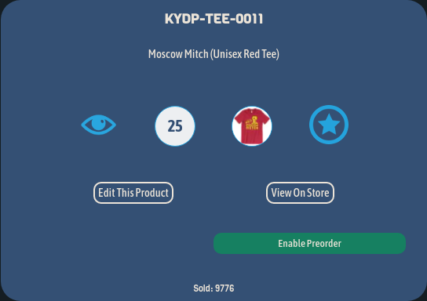
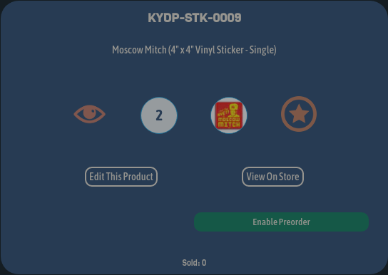
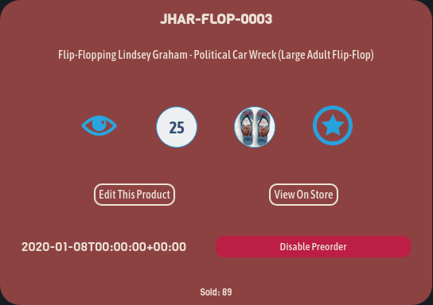
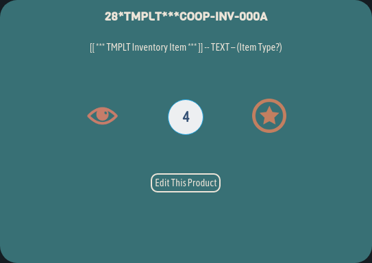
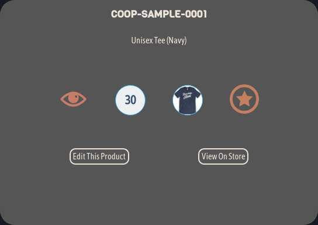
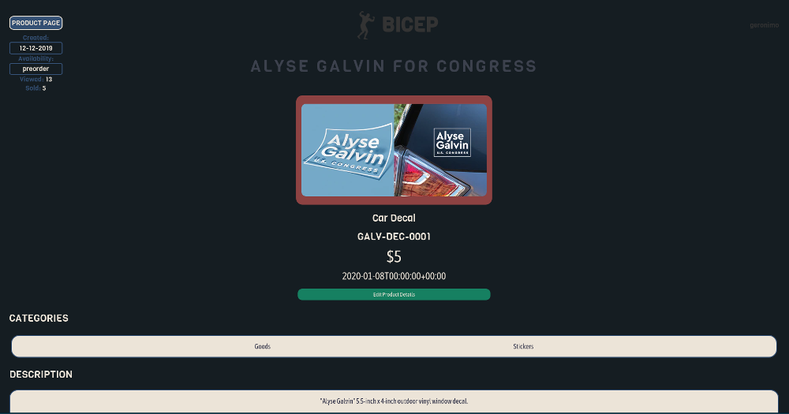

# [BICEP](https://bicep.bumperapptive.com)

## USAGE
- **Bicep** is composed of four main views (in order of access):
    + *Store Index*
        - Here you can see a list of all active stores.

            + This is an active, **launched** store
            

            + This is an active, **unlaunched** store
            

            + This store is in **maintenance mode**
            

    + *Product Index*
        - Here you can see a list of all active products, product templates and sample products.

            + This is an active, **visible** product.
            

                - Notice the blue eye.
                - Like on BigCommerce, the blue eye means the product is visible on the storefront.
                - The blue star means this is a *Featured Product*
                - Both icons can be toggled on/off with a click.

            + This is an active, **hidden** product.
            

                - Notice the orange eye and muted color.
                - Hidden products will always appear dim.

            + This is a **preorder** product.
            

                - Notice the reddish color.
                - This color will always correspond to preorder products.

            + This is a **product template**.
            

                - Notice the teal color.
                - This color will always correspond to product templates.

            + This is a **sample product**.
            

                - Notice the uninspiring gray color.
                - This color will always correspond to product samples.

    + *Product View*
        - After selecting a product in the Store View, you'll see information about it in the Product View.
        

            + This is the *product sidebar*
                - The *Product Page* button opens the BigCommerce product page in a new tab.
                - The sidebar also indicates:
                    + When the product was created
                    + Whether it is available or preorder
                    + Total views for this product.
                    + Sales total for this product.
                        - A high view total with a low sales total indicates that this is not a product people want.

    + *Variant View*
