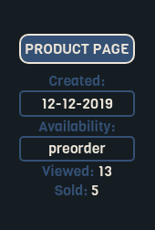
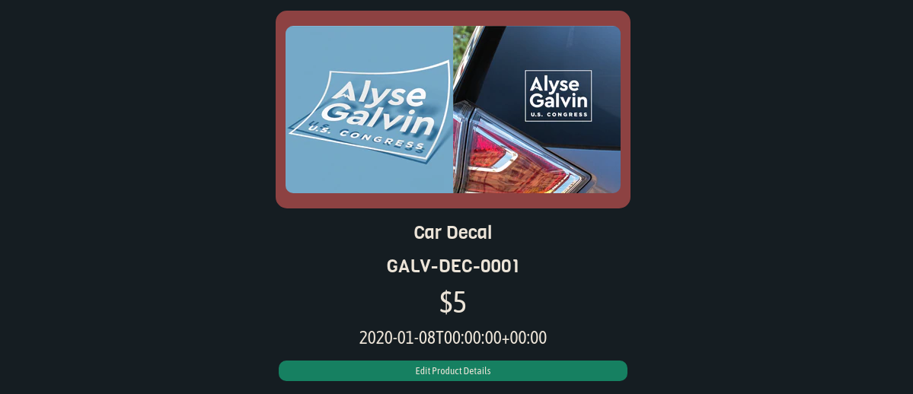
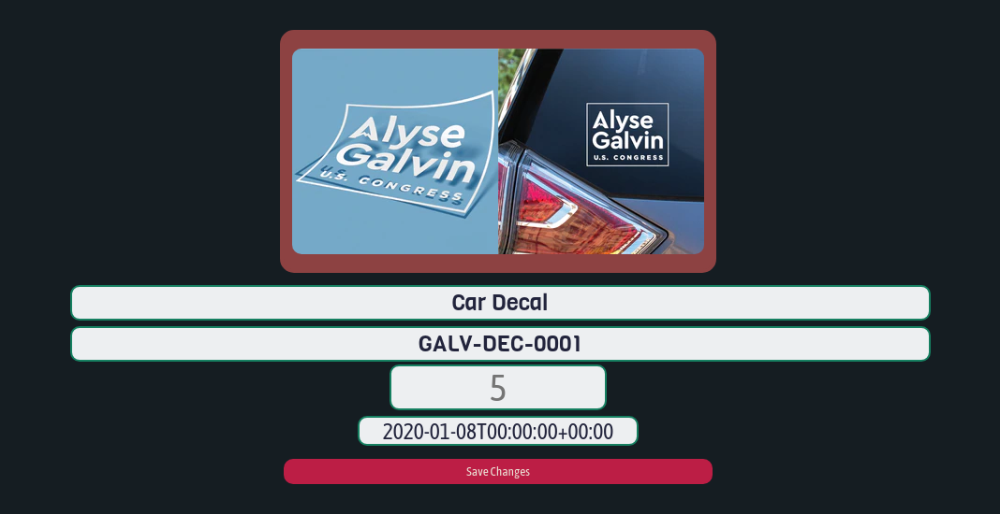
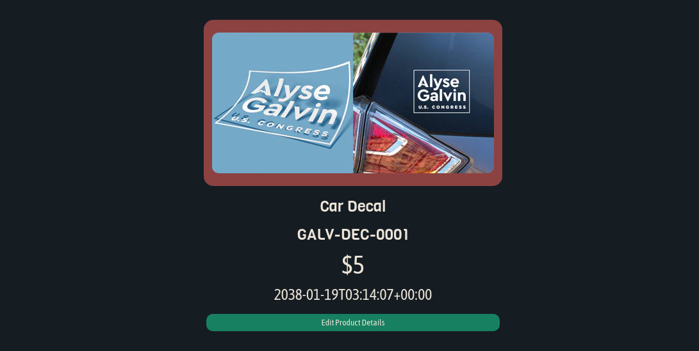

# [BICEP](https://bicep.bumperapptive.com)

## USAGE
#### **Bicep** is composed of four main views (in order of access):

- Store Index
- Product Index
- Product View
- Variant View

###### 1. ***Store Index***
    + Here you can see a list of all active stores.

        - This is an active, **launched** store
        

        - This is an active, **unlaunched** store
        

        - This store is in **maintenance mode**
        

    2. ***Product Index***
        - Here you can see a list of all active products, product templates and sample products.

            + This is an active, **visible** product.
            

                - Notice the blue icons.
                    + Like on BigCommerce, the blue eye means the product is visible on the storefront.
                    + The blue star means this is a *Featured Product*
                    + Both icons can be toggled on/off with a click.

                - The encircled number indicates the base price for the product.

                - Click the *Edit This Product* button to view/edit this product in greater detail.
                - Click the *View on Store* button to view the product on the storefront.

                - Click the *Enable Preorder* button to assign a preorder date to the product.
                - +[add screenshot]+

            + This is an active, **hidden** product.
            

                - Notice the orange eye and muted color.
                    + Hidden products will always appear dim.

            + This is a **preorder** product.
            

                - Notice the reddish color and preorder date.
                    + This color will always correspond to preorder products.

                - Click the *Disable Preorder* button to remove preorder status from the product.
                    + The page will reload and this product tile will have changed color.

            + This is a **product template**.
            

                - Notice the teal color.
                - This color will always correspond to product templates.

            + This is a **sample product**.
            

                - Notice the uninspiring gray color.
                - This color will always correspond to product samples.

    3. ***Product View***
        - After selecting a product in the Store View, you'll see information about it in the Product View.
        

            + This is the *product sidebar*

                
                - The *Product Page* button opens the BigCommerce product page in a new tab.
                - The sidebar also indicates:
                    + When the product was created.
                    + Whether it is available or preorder.
                    + Total views for this product.
                    + Sales total for this product.
                        - A **high view total** with a **low sales total** indicates that this is not a product people want.
                            + A 100 to 1 ratio, for example, is subpar.
                            + This product's 2.6 to 1 ratio is excellent.

            + Here are the product's *name*, *sku*, *price* and *preorder date*

                
                - Notice the green button.
                    + Click it and the text will turn into inputs
                    + The green button will turn red.

                
                - Now you can edit these values as needed.
                - Once you save your changes, the page will reload and display the updated values.

                
                - **WOW!**

    4. ***Variant View***
